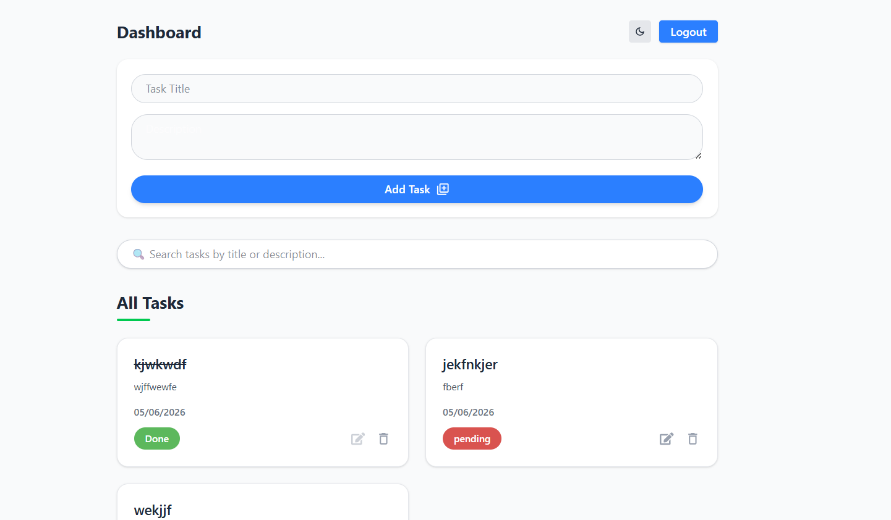
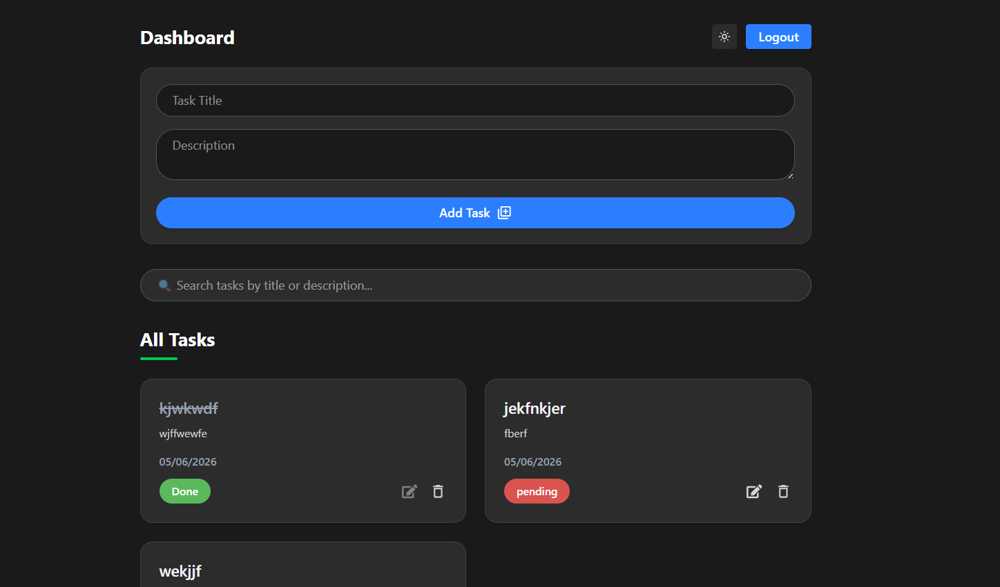
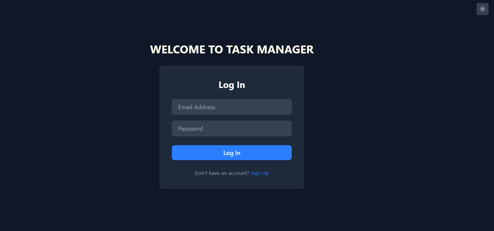
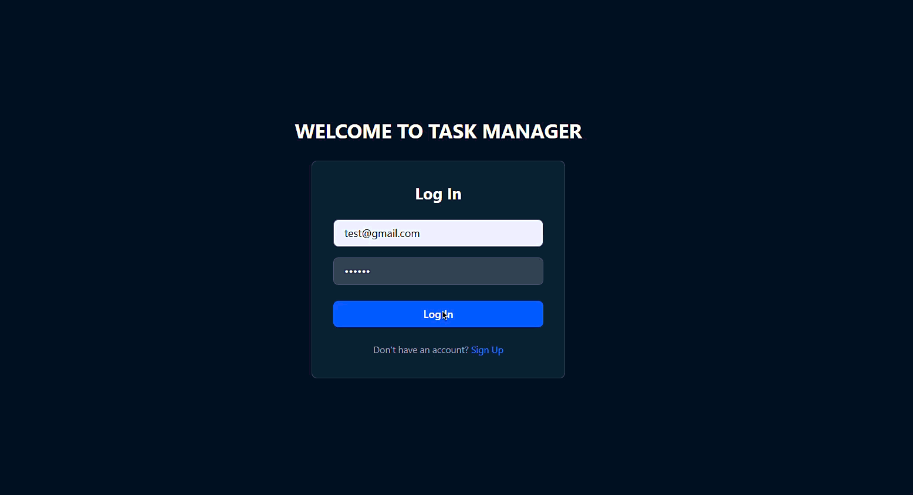

# 📋 Task Manager - MERN Stack

A full-stack Task Management application built using the MERN Stack (MongoDB, Express.js, React.js, Node.js). The application allows users to securely manage their daily tasks with authentication, task creation, editing, deletion, status tracking, and a responsive modern UI.

---

## 🚀 Features

- 🔐 User Authentication (JWT)
- 👤 User Registration & Login
- ➕ Create New Tasks
- ✏️ Edit Existing Tasks
- ✅ Mark Tasks as Completed
- 🔄 Undo Completed Tasks
- 🗑️ Delete Tasks
- 🌙 Dark Mode Support
- 📱 Responsive Design
- 🔒 Protected Routes
- ⚡ RESTful API Integration

---

## 🛠️ Tech Stack

### Frontend
- React.js
- React Router DOM
- Axios
- Tailwind CSS

### Backend
- Node.js
- Express.js
- MongoDB
- Mongoose
- JWT Authentication
- bcrypt.js

---

## 📸 Screenshots

### Dashboard



### Dark Mode



### Login Page



---

## 🎥 Demo Video



---

## ⚙️ Installation

### Clone Repository

```bash
git clone https://github.com/hassan-980/task-manager.git
cd task-manager
```

### Backend Setup

```bash
cd backend
npm install
```

Create a `.env` file:

```env
PORT=8000
MONGO_URI=your_mongodb_connection_string
JWT_SECRET=your_secret_key
```

Start Backend:

```bash
npm run dev
```

### Frontend Setup

```bash
cd frontend
npm install
npm run dev
```


   
   
